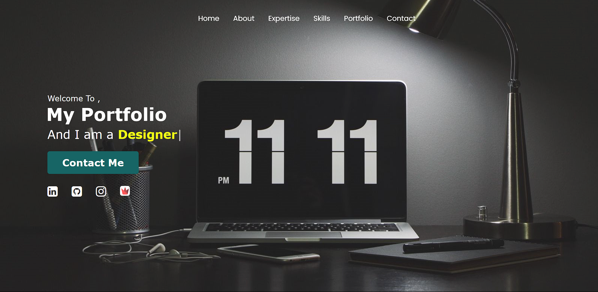

# Portfolio Website Project

## Introduction

I'm excited to present my Portfolio Website Project that I developed during my time at G. H. Raisoni College of Engineering & Management, Pune. This project is a culmination of my dedication, learning, and creative efforts, and it showcases my skills and accomplishments.

## Project Details

- **Project Name:** Gandharv's Design Portfolio
- **College:** G. H. Raisoni College of Engineering & Management, Pune

## Features

- Interactive and responsive design using HTML, CSS, and JavaScript.
- Dynamic content integration with PHP for easy updates.
- Showcase of my skills, projects, and achievements.
- Contact form for easy communication.

## Why This Project is Special

This project holds a special place in my heart as it marks a significant milestone in my journey as a developer. The website not only reflects my technical skills but also represents my growth and dedication throughout the development process.

## Acknowledgements

I would like to express my heartfelt gratitude to G. H. Raisoni College of Engineering & Management, Pune, for providing the platform and guidance that led to the creation of this awesome project. The college's supportive environment and the knowledge imparted during the bootcamp were instrumental in shaping my skills and enabling me to bring this project to life.

## Contact

Feel free to reach out to me through the contact form on my Portfolio Website or connect with me on [LinkedIn](https://www.linkedin.com/in/gandharvk422).

Thank you for taking the time to explore my Portfolio Website Project!
